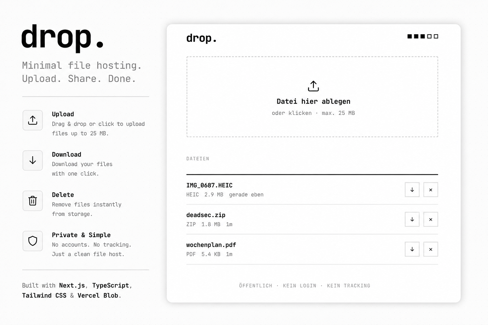

# drop.

Minimal public file hosting. Upload. Share. Done.

→ **[drop.hrmtm.de](https://drop.hrmtm.de)**

---

## Features

- **Drag & drop** or click to upload
- **Max 5 files** stored at once, **25 MB** per file
- **One-click download** via direct Vercel Blob URL
- **Instant delete** — no confirmation needed
- **No login, no accounts, no tracking**

## Stack

| | |
|---|---|
| Framework | Next.js 15 (App Router) |
| Language | TypeScript |
| Storage | Vercel Blob |
| Hosting | Vercel |

## Self-hosting

```bash
git clone https://github.com/hrmtm/drop
cd drop
npm install
```

Add a `.env.local`:

```env
BLOB_READ_WRITE_TOKEN=vercel_blob_rw_...
```

Get the token from [vercel.com](https://vercel.com) → Storage → your Blob store → Manage → Tokens.

```bash
npm run dev
```

## Deploy to Vercel

[](https://vercel.com/new/clone?repository-url=https://github.com/hrmtm/drop)

After deploying, connect a Vercel Blob store and set `BLOB_READ_WRITE_TOKEN` as an environment variable.

---

Built by [hrmtm](https://hrmtm.de)
